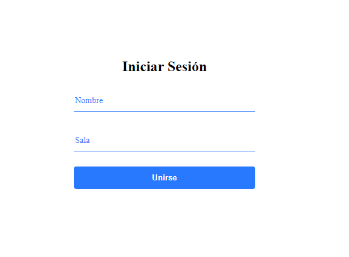

## Chat App Client

Cliente de aplicación de chat en tiempo real desarollado con React.js y Socket.io
## ¿Que tiene?

- Crear una sala
- Ingresar a una sala
- Chat en tiempo real

## Tecnologías utilizadas

- React.js
- Node.js

Podes encontrar el server haciendo click **[aquí](https://github.com/lautivalentini/chat-app-server)**

## Screenshots

